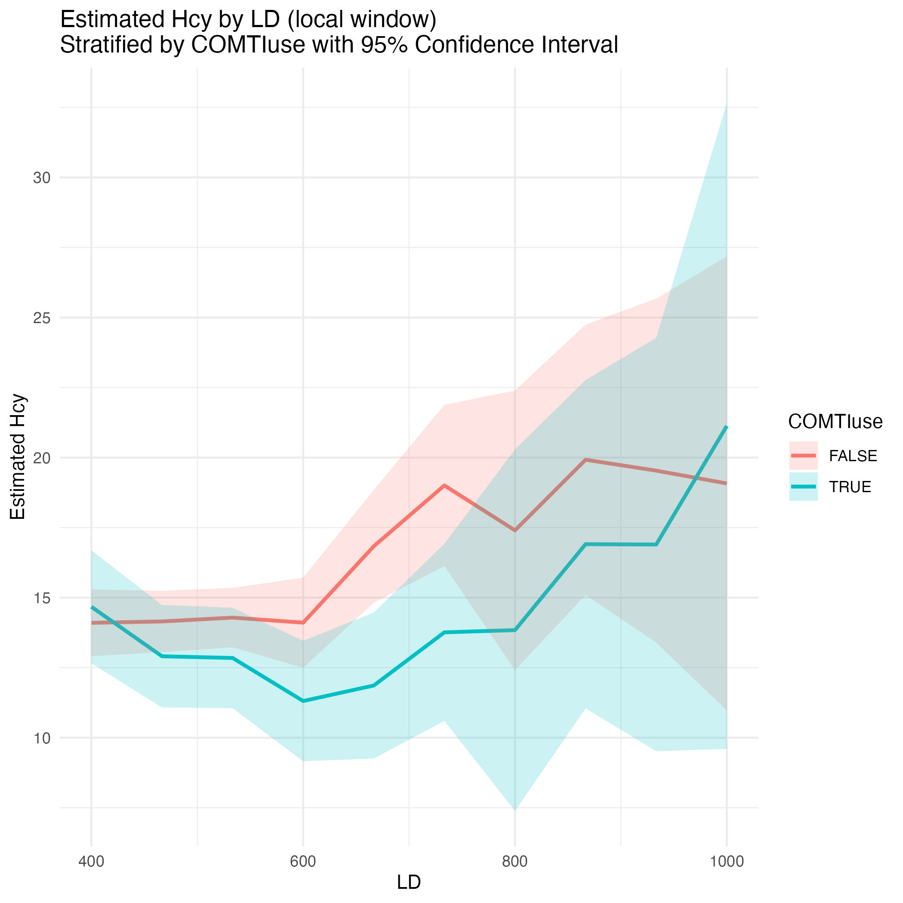

# Introduction
Levodopa vs Hcy vs VitB6

## Data Ingestion

- **Data file:** `data/Vitamine B6 data.xlsx`
- **Script:** `code/clean_data.r`
- **Output files:**
  - `temp/cleaned_data.csv` (cleaned data)
  - `report/histograms.pdf` (histograms before outlier removal)
  - `report/histograms_4sd_removed.pdf` (histograms after outlier removal)

### Data Overview

**Columns with no missing values:**  
`DN`, `ID`, `DOE`, `MoCAJ`, `Sex`, `Disease`, `HY`, `AOE`, `DOB`, `Total_LEDD`, `DA_LEDD`, `Dopa_LEDD`, `LD_LEDD`, `LD`, `LC`, `LB`, `DCI`, `AST`, `ALT`, `AST_ALT_ratio`, `LDH`, `Cre`, `Hb`, `Pyridoxamine`, `VitB6_Pyridoxal`, `logB6`, `Pyridoxine`, `VitB12`, `FA`, `Hosp`

**Columns with missing ratio between 0 and 0.1:**  
`COMT-Iduration(month)`, `BH`, `BW`, `BMI`, `AOO`, `DD`, `LDBW`, `gGTP`, `Fib4`, `CK`, `Alb`, `ChE`, `VitB1`, `Hcy`

**Columns with missing ratio > 0.1:**  
`COMT-Istart`, `LCnCOMTI`, `LCCOMTI`, `LBnCOMTI`, `LBCOMTI`, `LCIG`, `EN`, `OPC`, `SEL`, `RAS`, `SAF`, `PRG`, `CAB`, `BRC`, `PPX`, `PPX_ER`, `RPR`, `RPR_CR`, `RPR_Patch`, `RTG`, `APO`, `AMA`, `THP`, `DRX`, `ISD`, `ZNS`, `DPZ`, `GAL`, `RIV`, `MEM`, `SSRI`, `SNRI`, `SARI`, `TCA`, `QTP`, `CZP`, `OAP`, `Vitamine`, `L_DOPA`, `DOPAC`, `OMD3`, `DA`, `HVA`

**Selected columns:**  
`ID`, `Sex`, `HY`, `COMTIuse`, `AOE`, `LD`, `LD_LEDD`, `Total_LEDD`, `LDBW`, `Dopa_LEDD`, `DCI`, `AST`, `ALT`, `LDH`, `Cre`, `Hb`, `VitB6_Pyridoxal`, `VitB12`, `FA`, `BW`, `DD`, `CK`, `Alb`, `Hcy`, `gGTP`, `Alb`, `ChE`, `VitB1`

### Outlier Removal

Replace values outside mean ± 4SD with null:

- LDBW: 1 outlier (High: 29.02, Low: -8.33)
- DCI: 1 outlier (High: 274.76, Low: -126.88)
- ALT: 1 outlier (High: 37.98, Low: -17.1)
- LDH: 1 outlier (High: 356.12, Low: 38.2)
- VitB6_Pyridoxal: 4 outliers (High: 39.46, Low: -24.42)
- VitB12: 3 outliers (High: 1438.03, Low: -769.86)
- DD: 2 outliers (High: 35.31, Low: -15.24)
- CK: 3 outliers (High: 436.32, Low: -193.52)
- Alb: 1 outlier (High: 5.39, Low: 2.87)
- Hcy: 3 outliers (High: 51.41, Low: -20.51)
- gGTP: 2 outliers (High: 97.57, Low: -49.17)
- VitB1: 2 outliers (High: 68, Low: -10.07)
- logHcy: 1 outlier (High: 4.24, Low: 1.04)
- logVitB12: 1 outlier (High: 7.77, Low: 3.51)

_Before and after outlier removal were saved in the `report` folder._

---

## Analysis of Hcy

- **Data:** `temp/cleaned_data.csv`
- **Script:** `analyze_Hcy.r`
- **Output files:**
  - `report/ld_hcy_local_estimate.jpg` (main figure)
  - Other figures and tables as generated

### Base Model

```r
lm(formula = Hcy ~ AOE + DD + DCI + Sex + BW + COMTIuse + VitB6_Pyridoxal + 
    VitB12 + FA + LD + I(as.factor(HY)), data = df)

Residuals:
     Min       1Q   Median       3Q      Max 
-11.8623  -3.0429  -0.7791   2.0789  24.4688 

Coefficients:
                   Estimate Std. Error t value Pr(>|t|)    
(Intercept)       12.940448   4.283641   3.021 0.002804 ** 
AOE                0.155946   0.037419   4.168 4.35e-05 ***
DD                -0.080874   0.063851  -1.267 0.206573    
DCI               -0.008309   0.009062  -0.917 0.360186    
Sex               -2.084149   0.820528  -2.540 0.011742 *  
BW                -0.037371   0.035709  -1.047 0.296402    
COMTIuseTRUE      -2.568244   0.785215  -3.271 0.001237 ** 
VitB6_Pyridoxal   -0.092706   0.069013  -1.343 0.180488    
VitB12            -0.006592   0.001864  -3.536 0.000490 ***
FA                -0.431899   0.096304  -4.485 1.15e-05 ***
LD                 0.005062   0.002234   2.265 0.024415 *  
I(as.factor(HY))2  1.518970   1.111895   1.366 0.173233    
I(as.factor(HY))3  4.737302   1.289474   3.674 0.000297 ***
I(as.factor(HY))4  1.237514   1.698917   0.728 0.467098    
I(as.factor(HY))5  2.325548   3.144026   0.740 0.460250    
---
Signif. codes:  0 ‘***’ 0.001 ‘**’ 0.01 ‘*’ 0.05 ‘.’ 0.1 ‘ ’ 1

Residual standard error: 5.003 on 231 degrees of freedom
  (16 observations deleted due to missingness)
Multiple R-squared:  0.3368,    Adjusted R-squared:  0.2966 
F-statistic: 8.378 on 14 and 231 DF,  p-value: 1.615e-14
```

### Log-Converted Model

```r
lm(formula = logHcy ~ AOE + I(AOE^2) + DD + BW + DCI + Sex + 
    COMTIuse + logVitB6 + logVitB12 + logFA + LD + I(as.factor(HY)), 
    data = df)

Residuals:
     Min       1Q   Median       3Q      Max 
-0.93730 -0.19215 -0.00063  0.15386  1.19137 

Coefficients:
                    Estimate Std. Error t value Pr(>|t|)    
(Intercept)        5.0900134  0.6739664   7.552 9.22e-13 ***
AOE               -0.0252243  0.0183977  -1.371 0.171654    
I(AOE^2)           0.0003019  0.0001403   2.152 0.032402 *  
DD                -0.0022515  0.0035992  -0.626 0.532216    
BW                -0.0016824  0.0020272  -0.830 0.407430    
DCI               -0.0007392  0.0005266  -1.404 0.161718    
Sex               -0.1523137  0.0467301  -3.259 0.001280 ** 
COMTIuseTRUE      -0.1660370  0.0445558  -3.726 0.000243 ***
logVitB6          -0.0533804  0.0279443  -1.910 0.057309 .  
logVitB12         -0.2242124  0.0375015  -5.979 8.21e-09 ***
logFA             -0.2993852  0.0478430  -6.258 1.81e-09 ***
LD                 0.0001776  0.0001307   1.359 0.175471    
I(as.factor(HY))2  0.1127594  0.0638698   1.765 0.078775 .  
I(as.factor(HY))3  0.2699834  0.0734420   3.676 0.000293 ***
I(as.factor(HY))4  0.1525065  0.0957405   1.593 0.112512    
I(as.factor(HY))5  0.1696050  0.1815751   0.934 0.351215    
---
Signif. codes:  0 ‘***’ 0.001 ‘**’ 0.01 ‘*’ 0.05 ‘.’ 0.1 ‘ ’ 1

Residual standard error: 0.2867 on 237 degrees of freedom
  (9 observations deleted due to missingness)
Multiple R-squared:  0.4775,    Adjusted R-squared:  0.4444 
F-statistic: 14.44 on 15 and 237 DF,  p-value: < 2.2e-16
```

### Rolling Range Analysis (Base Model)

LD center ± 150 mg/day

```r
> results
   ld_center   N N_user N_non_user    estimate        sd            p
1        200  49      5         44   2.1237259 2.3992193 0.3819372906
2        300  74     10         64  -0.4893657 1.6368808 0.7660018445
3        400 116     21         95   0.5715278 1.0834684 0.5989931103
4        500 126     32         94  -1.3509195 0.9934879 0.1766569448
5        600  93     34         59  -2.7972924 1.1383542 0.0162175838
6        700  88     33         55  -4.9891389 1.4209602 0.0007691289
7        800  46     22         24  -3.5608311 3.0682085 0.2546817730
8        900  38     18         20  -2.7592247 3.0147966 0.3691768638
9       1000  21      9         12   2.0527662 3.9174880 0.6164546277
10      1100  12      6          6 -25.2318265       NaN          NaN
```

### Figure: Estimated Hcy per LD/day


